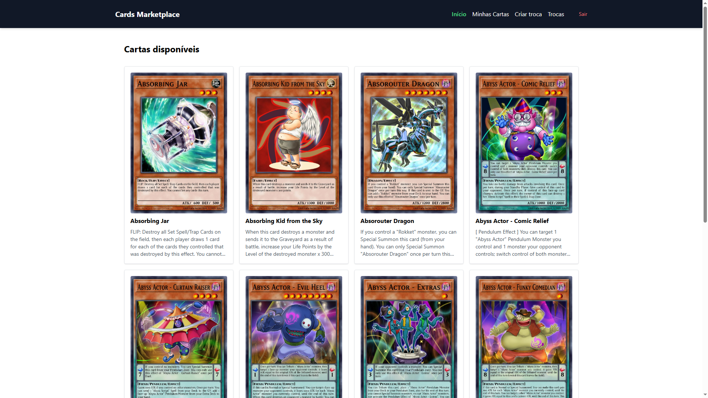
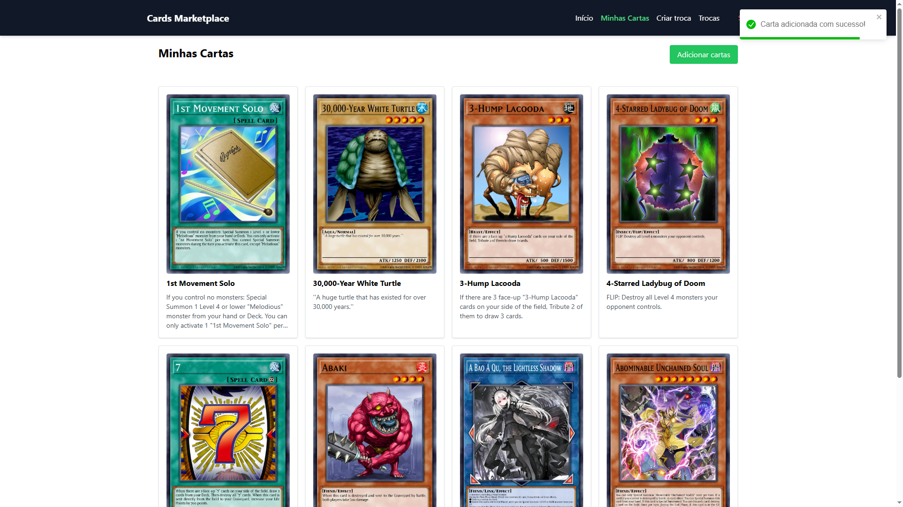
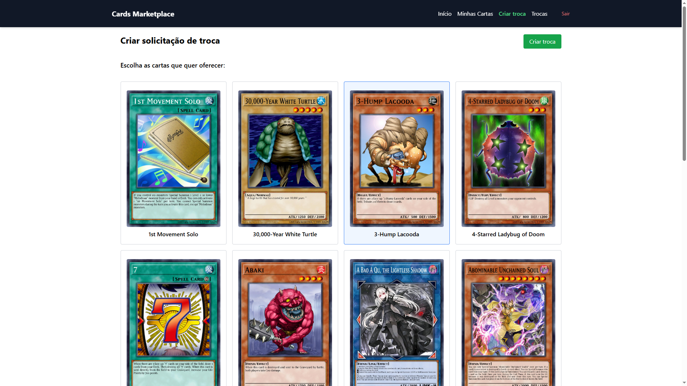
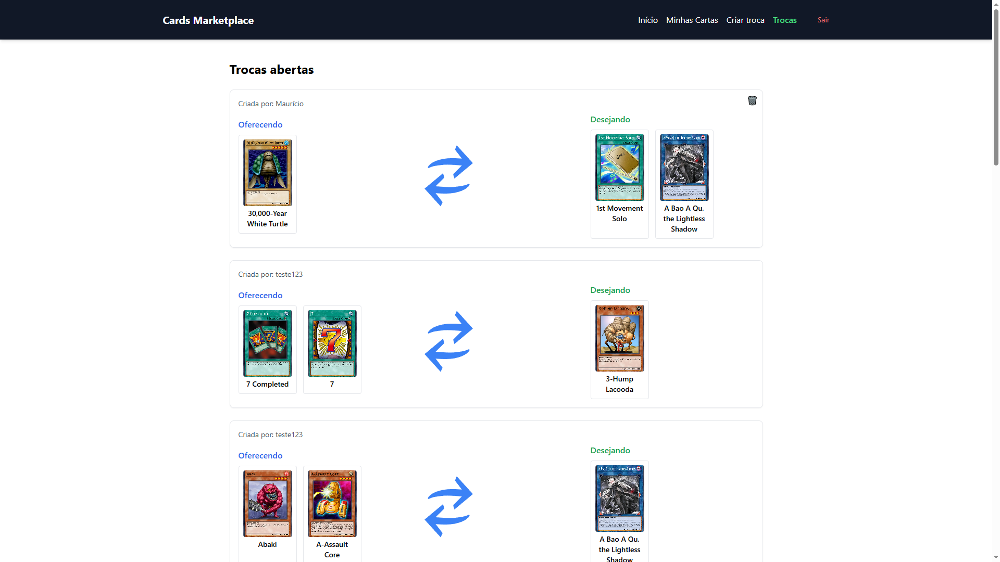

<div align="center"> <h1>Teste técnico INMETA - Cards Marketplace</h1> </div>

## 📝 Sobre o projeto

Aplicação desenvolvida para o teste técnico da INMETA, simulando um marketplace de troca de cartas. Usuários podem se registrar, fazer login, adicionar cartas à sua conta, criar e deletar solicitações de troca, além de navegar pelas trocas abertas disponíveis na plataforma. O projeto foi estruturado com foco em uma arquitetura limpa, responsiva e mobile-first, com uso de componentes reutilizáveis e semânticos.

## 🛠 Tecnologias utilizadas

- **Vue.js** - Framework JavaScript progressivo
- **Pinia** - Gerenciamento de estado moderno e intuitivo
- **Vue Router** - Gerenciamento de rotas no Vue.js
- **Tailwind** - Utilitário de estilos para criação rápida de UI responsiva

## 📸 Screenshots

<p align="center">
  
</p>

<p align="center">
  
</p>

<p align="center">
  
</p>

<p align="center">
  
</p>

## 🌐 Acesse o projeto online

Você pode acessar a versão online do projeto [aqui](https://mauricio-cards-marketplace.netlify.app).

## 🖥️ Como configurar o projeto

Siga os passos abaixo para instalar e executar o projeto em seu ambiente local:

### 1. Clone o repositório:

```bash
$ git clone https://github.com/mauricio071/Teste-tecnico-INMETA
```

### 2. Acesse o diretório do projeto:

```bash
$ cd Teste-tecnico-INMETA
```

### 3. Instale as dependências necessárias:

```bash
$ yarn install
```

### 4. Inicialize o projeto:

```bash
$ yarn dev
```

Agora você pode acessar o projeto no navegador em http://localhost:5173 (ou na porta indicada pelo terminal).

---

## 📚 Documentação da API

A aplicação consome os dados da [API Cards Marketplace](https://cards-marketplace-api-2fjj.onrender.com), responsável por fornecer os recursos necessários para autenticação de usuários, adição e listagem de cartas, criação e remoção de solicitações de troca, além da exibição pública das trocas abertas no marketplace.
